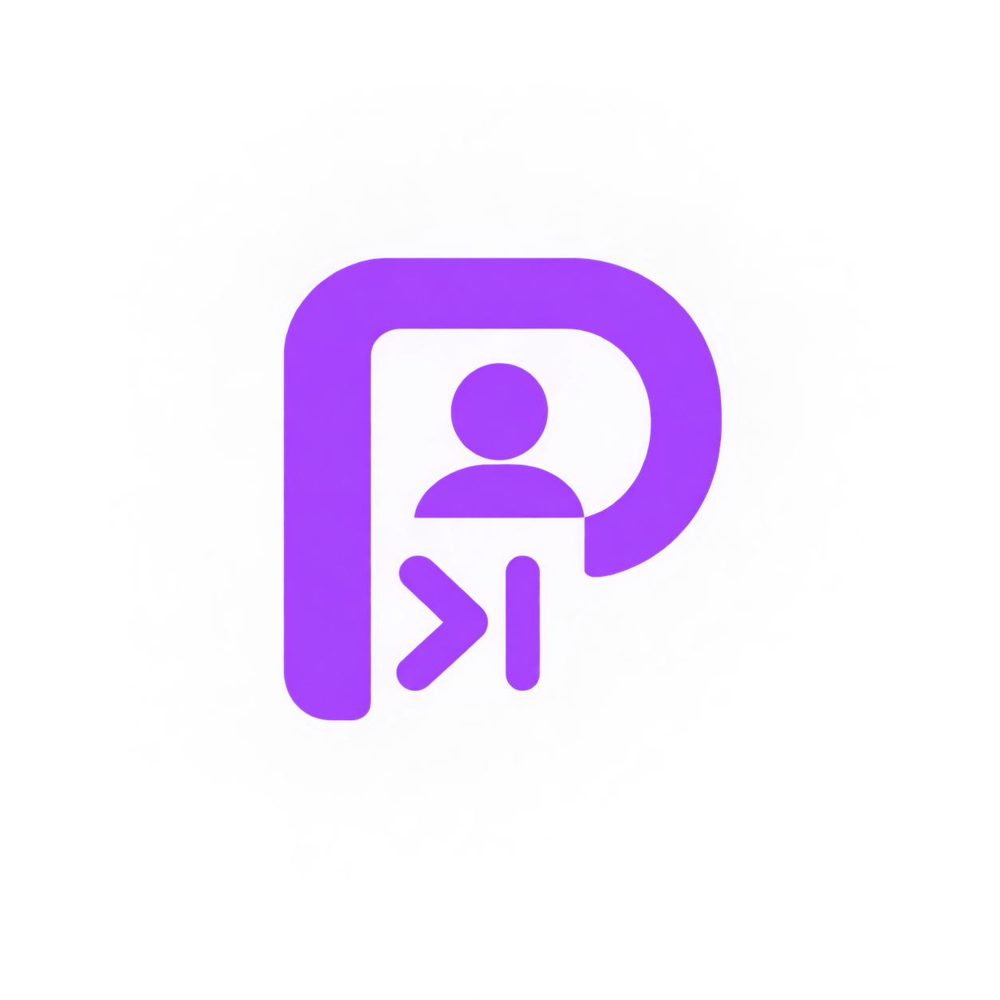
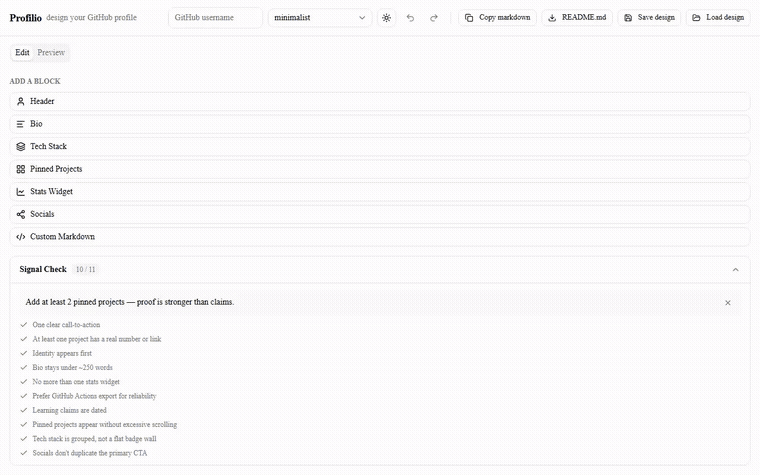
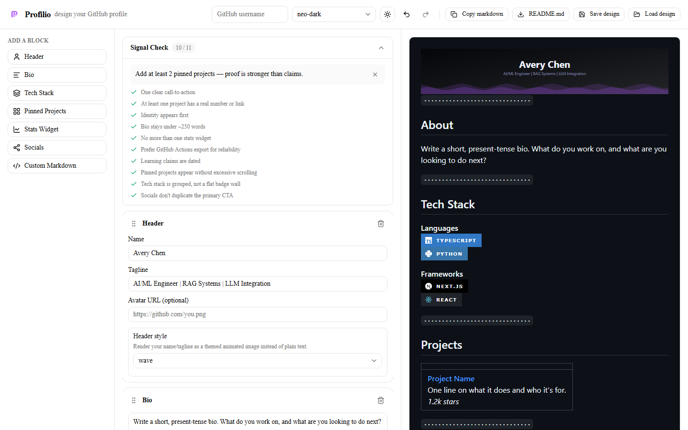
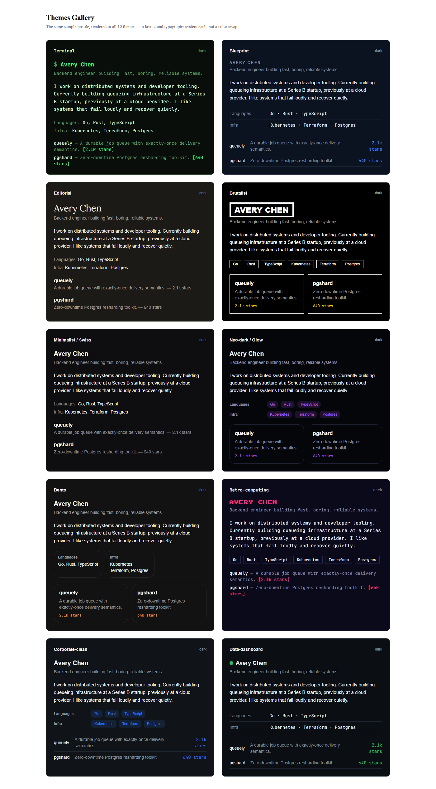

# Profilio

**Design your GitHub profile like a designer, not a form-filler.**

[](https://github.com/TheAmitChandra/Profilio/actions/workflows/ci.yml)
[](LICENSE)

**[Live demo →](https://profilio.byteblendmatrix.com)**



Profilio is a live visual canvas for building your GitHub profile `README.md` — drag-and-drop blocks, ten genuinely distinct themes (different layouts and typography, not just color swaps), an instant preview of exactly what GitHub will render, and a "Signal Check" linter that nudges you toward a focused profile instead of a badge wall.

## Why Profilio

Most profile-README tools fall into two camps:

- **SVG-widget services** (`github-readme-stats` and friends) generate stat images but leave you to hand-assemble markdown yourself, with no editing surface at all.
- **Form-based generators** let you fill in fields and reorder sections, but produce templated output with no real design system and no opinion about what makes a profile good.

Neither combines a true visual editor with a design system worth using — and neither tells you when your profile has become a wall of badges nobody will read. Profilio does three things differently:

1. **A real canvas**, not a settings form — every block is edited inline, reordered by drag-and-drop (mouse or keyboard), with the preview updating live.
2. **Ten themes that are actual design systems** — different heading treatments, divider styles, tech-stack and project layouts, and typography, because GitHub strips custom CSS from profile READMEs so "distinct" has to come from structure, not a color variable.
3. **A Signal Check linter** — an 11-rule, dismissible-suggestion panel (never a blocker) that flags the patterns that make profiles read as clutter: too many competing links, a badge wall instead of grouped categories, a "passion paragraph" bio, undated "currently learning X" claims.

It also ships two ways to embed live stats, not one: a hosted SVG endpoint for convenience, and a GitHub Actions export mode that renders the same themed cards from your own authenticated workflow — so your profile doesn't break when a shared public endpoint gets rate-limited.

## Quick start

Try it live at **[profilio.byteblendmatrix.com](https://profilio.byteblendmatrix.com)** — no install needed. To run it locally instead:

```bash
git clone https://github.com/TheAmitChandra/Profilio.git
cd Profilio
pnpm install
pnpm dev
```

Open [http://localhost:3000](http://localhost:3000) for the editor, or [http://localhost:3000/themes-gallery](http://localhost:3000/themes-gallery) to compare all ten themes against the same sample content.

There's no backend, no database, and no account — your in-progress design autosaves to `localStorage`, and `profilio-design.json` (via **Save design** / **Load design**) is the portable format if you want to back it up or hand it to someone else.

## The editor



Three panels: a block library on the left, the canvas in the middle (with the live Signal Check score), and a preview on the right rendered with `react-markdown` and GitHub's own `github-markdown-css` — what you see is what your profile will actually look like on github.com, not an approximation. Narrow viewports collapse to an Edit/Preview tab switcher instead of squeezing three columns.

## Themes gallery

The same sample profile, rendered in all ten themes:



Terminal, Blueprint, Editorial, Brutalist, Minimalist/Swiss, Neo-dark/Glow, Bento, Retro-computing, Corporate-clean, and Data-dashboard — each ships a dark and light variant sharing the same token structure, and each was checked against WCAG AA contrast for both.

## Exporting

- **Copy markdown** to your clipboard, one click.
- **Download `README.md`** directly.
- **Save design** / **Load design** for the portable `profilio-design.json` format.
- Paste the result into your `<username>/<username>` repo.

## Stats widgets: hosted vs. Actions-export

Add a Stats Widget block and pick a mode:

- **Hosted** renders a themed SVG on the fly from `/api/og/[themeId]`, using the unauthenticated GitHub REST API. Fine for trying things out, but subject to the same shared-rate-limit problem that plagues every public stats-badge service.
- **Actions-export** is the reliable path: copy [`.github/workflows/stats-export-template.yml`](.github/workflows/stats-export-template.yml) into your own profile repo. It runs `scripts/generate-stats-svgs.mjs` with your repo's own `GITHUB_TOKEN`, which — unlike the hosted route — can query the GraphQL `contributionsCollection` API for real streak and activity data, and commits the resulting SVGs straight into your repo.

## Contributing

See [CONTRIBUTING.md](CONTRIBUTING.md) for local setup, how to add a theme, and how to add a Signal Check rule.

## Tech stack

Next.js 16 (App Router, TypeScript) · Tailwind CSS + shadcn/ui · `@dnd-kit` · Zustand · `react-markdown` + `remark-gfm` · Satori (themed SVG cards) · Vitest + Playwright

## License

[MIT](LICENSE)
